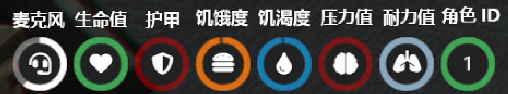

# 基础按键与功能

## 介绍

#### 这篇文章会详细介绍所有的基础按键与基础交互功能 你可以在这里找到你想要的答案


## 交互对象

**当我们对准交互的NPC按住 ALT 键时 屏幕的中间会出现一个 "眼睛" 图标 如果我们正确的对准交互目标 它会变成绿色 然后我们按一下鼠标右键 则会弹出一个鼠标 让你选择相应的选项**

 (1) (1).png>)


## 多功能菜单

当我们按 F1 键 则会打开一个多功能菜单 在这个菜单中包含了(服装的脱换等...)

 (1).png>)


## 背包功能

当我们按 TAB 键 则可以打开背包或车辆后备箱功能 按 Z 键可以快速查看快捷栏的物品

 (1).png>)

#### 容量

每个玩家的背包或载具后备箱都是有固定容量的 每个不同的物品也有不同的重量 当玩家背包容量满了时 则无法再往背包里放东西

#### 玩家背包容量显示

 (2).png>)

#### 物品重量显示

 (1).png>)

#### 6号位 （隐藏储物格）

在每个玩家的背包菜单最底部都会有一个标注 “6” 的格子 这是一个玩家们的隐藏格子 当我们被其他玩家打劫时 这个格子内的物品是无法被其他玩家发现的 但注意！如果警察搜身则是可以查看6号位的物品的

 (1) (2) (1).png>)


## 语音系统

#### 启动语音系统

在海滨都市角色扮演服务器中 我们要求所有玩家必须拥有麦克风才可以进行扮演 因此语音系统是必不可少的 你可以在 ESC - 设置 - 语音聊天中开启语音系统 否则你会无法听到其他玩家的说话内容 同时你说话对方也听不到（这一步是每个海滨玩家必须要做的）

.png>)

#### 说话按键与说话模式(范围)

已经开启了语音系统后 在游戏中我们按住 N 键可以直接与其他玩家进行对话 当我们按 \~ 键 则可以调整游戏的说话范围 游戏屏幕的右下角也会显示你当前的说话范围与对讲机频率

 (3).png>)

#### 对讲机功能

你可以通过工具店来购买对讲机 当我们拥有了对讲机后 我们需要打开对讲机并设置频率 在游戏内按Caps(大小写键)键使用对讲机进行说话（注意！对讲机说话附近的人也能听到哈！）

红色箭头代表设置频率 中间的数字代表频率（你可以自己设置）

 (1).png>)


## 手机

#### 手机的用处

在这座全是由玩家构成的世界中 没有社交可如何在这座城市立足？ 你可以使用手机完成交罚单，打电话，发短信，等用处...

#### 手机的获得

你可以通过在工具店购买一部手机

 (1).png>)

#### 手机的使用

当我们拥有手机后在游戏内 按 M 键即可打开手机

 (1).png>)


## HUD

#### 图标介绍




#### HUD设置

你可以在游戏内按 i 键 打开HUD设置菜单


## 载具按键

```
G - 开/关 发动机
B - 安全带
U - 锁车
F - 上/下车
```
