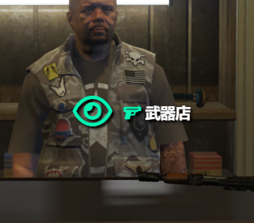

# 货运工作

### **货运工作是一个可多人合作制工作 你可以创建一个小队 召集一位你的老铁与你一起进行工作 工作后的收益是一致的 因此这是一个你可以和你的好基友培养感情的工作**

**开始这项工作之前我们需要先去便利店或工具店买一个平板电脑**

**不会买东西的可以看左侧目录里有便利店买东西的教程**

.png>)

**然后我们现在前往地图上的货运公司**

.png>)

**在这你可以看到一个长得却黑的NPC对他按住 \[ ALT ] 键使用小眼睛进行交互**

**如果你不会用小眼睛 那么在目录里的 "基础按键与功能" 里有教**

.png>)

**我们点击 加入工作后 此时你就可以看到所有此工作的团队了**&#x20;

**你也可以自己创建一个团队 召集你的好基友一起进行此工作**

.png>)

**当我们召集好所有的好基友后 团队的队长可以在平板电脑里 点击“开始工作”选项开始工作**

.png>)

**然后 我们点击绿色的对号**

**然后我们接着找到刚刚的老黑NPC 对准他进行交互 然后我们点击获取车辆**

.png>)

**然后我们登上载具 按照平板电脑中的流程进行工作**

.png>)

**当我们到达了指定的便利店后 我们下车走到车辆的后备箱处**

**按住 \[ ALT ] 对准车的后备箱 然后取出包裹**

.png>)

**然后我们走到便利店的储物间里**

.png>)

**此时我们对准货架按住 \[ ALT ] 进行交货**

.png>)

**当我们送完了3个包裹后 我们返回货运公司找那个老黑NPC还车**

.png>)

**我们对NPC按住 \[ ALT ] 键 还车**

.png>)

